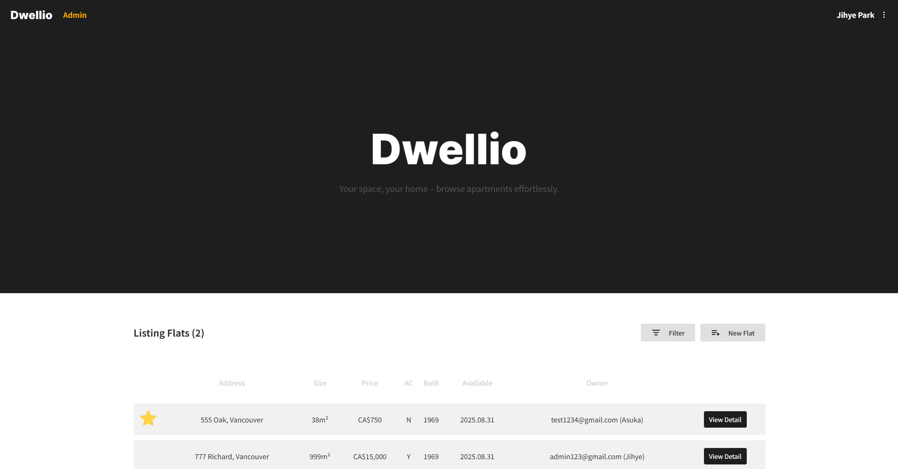
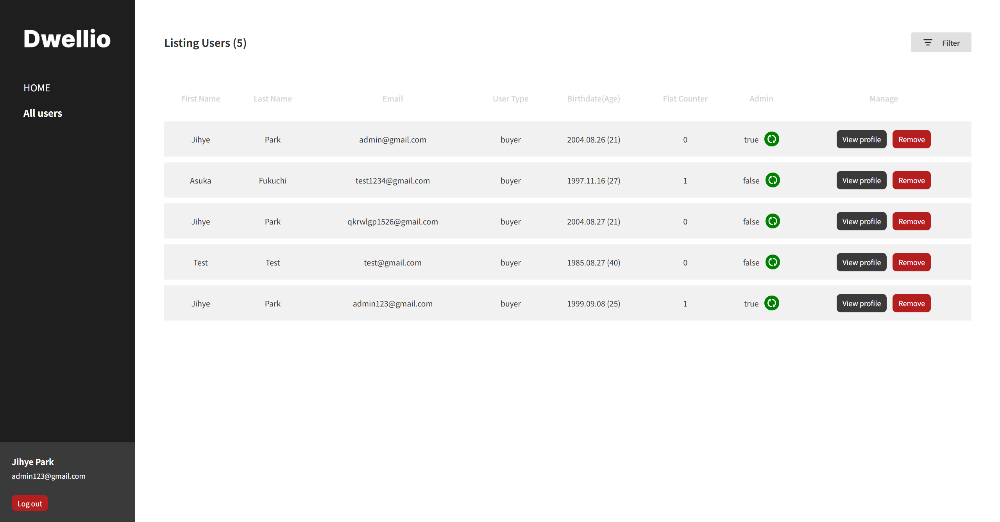
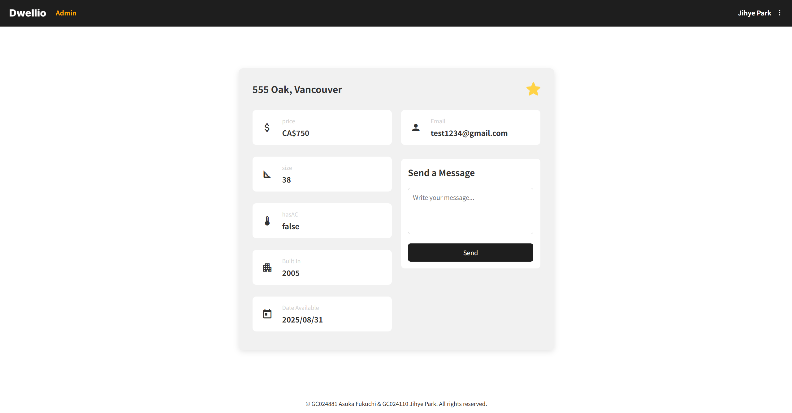

# 🏠 Flat Project

A simple website that shows apartment listings along with landlord information (name, email).  
Users can send and receive messages, and also bookmark/manage favorite flats.

---

## 📑 Table of Contents

- [About](#-flat-project)
- [Skills](#-skills)
- [Features](#-features)
- [Screenshots](#-screenshots)
- [Project Structure](#-project-structure)
- [How to Run](#-how-to-run)
- [Contact](#-contact)

---

## 🛠 Skills

**Frontend**

<p align="left">
  
  
  
  
  
</p>

**Backend & Tools**

<p align="left">
  
  
  
  
  
</p>

---

## ✨ Features

- 🏠 View apartment listings with details
- 👤 Display landlord info (name, email)
- ⭐ Bookmark favorite flats
- 💬 Send & receive messages between users

---

## 🖼 Screenshots





---

## 📂 Project Structure

```
flat-project/
├── backend/ # Backend (Node.js + Express + MongoDB)
│ ├── db/ # Database connection (connect.ts)
│ ├── models/ # Data models (flat, message, user)
│ └── routes/ # API routes (flat, message, user)
└── frontend/ # Frontend (Angular)
└── src/app/
├── components/ # Reusable UI components (header, footer)
├── pages/ # Page-level views (admin, auth, flat, home, my-page)
└── services/ # Angular services (auth, flat, message, user)
```

---

## 📦 Dependencies

### Frontend

- Angular CLI ^20.1.5
- Angular Compiler CLI ^20.1.0
- TypeScript ~5.8.2
- Karma / Jasmine (for testing)

### Backend

- Node.js (LTS)
- Express
- Mongoose
- dotenv
- cors
- jsonwebtoken
- bcrypt
- TypeScript ^5.9.2
- ts-node, nodemon (for development)

---

## 🚀 How to Run

1. Clone repository

   ```
   git clone https://github.com/username/flat-project.git
   cd flat-project
   ```

2. Install dependencies (both frontend & backend)

   ```
   cd frontend && npm install
   cd ../backend && npm install
   cd ..
   ```

3. Set environment variables <br>
   Create a .env file inside /backend:

   ```
   MONGO_URI=mongodb_connection_string
   PORT=3000
   JWT_SECRET=jwt_secret_key
   SECRET_ADMIN_KEY=SuperSecretAdmin2025
   ```

   ℹ️ If you want to register as an admin, just add ?adminkey=SuperSecretAdmin2025 to the register page URL. <br>
   Example: http://localhost:4200/register?adminkey=SuperSecretAdmin2025

4. Run the project (from root folder)

   ```
   npm run dev
   ```

   The dev script at the root will start both frontend (Angular) and backend (Express + Mongoose) simultaneously.

---

## 📬 Contact

- Jihye Park — qkrwlgp1526@gmail.com
- Asuka Fukuchi — afukuchi24@gmail.com
